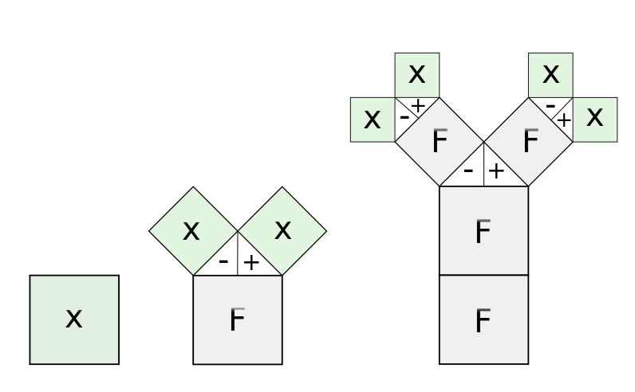
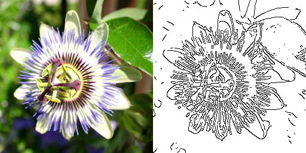
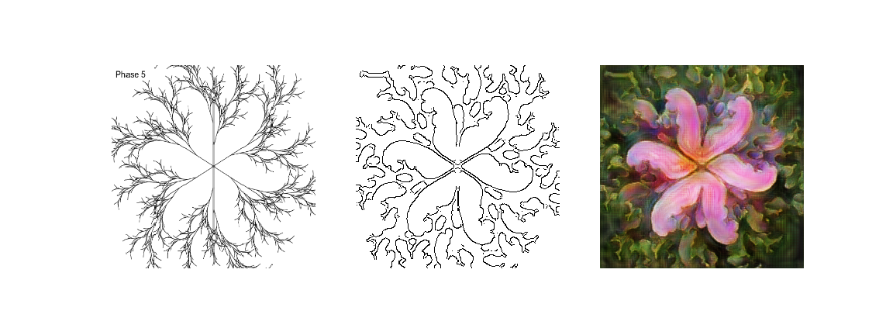

# L-Systems Flowerified

Build a self-similar stick-figure fractal by following the rules of L-Systems grammar, and "flowerify" the result with the help of pix2pix magic!


## Contents
- [Background](#background)
  - [L-Systems](#lsystems)
  - [pix2pix](#pix2pix)
- [Getting Started](#gettingstarted)
  - [Prerequisites](#prerequisites)
  - [Setup](#setup)
- [How it all works](#implementation)
- [Acknowledgments](#acknowledgments)

## Background <a name="background"></a>
### L-Systems <a name="lsystems"></a>
Despite what you've been taught in Calculus class, many real-life systems do not become smoother and simpler as you zoom in, but, quite the opposite, retain their complexity even on the smallest of scales. The coastline of Britain (a classic example) looks just as squiggly on the world map as it does on the regional map. The "degree" of squiggliness at different scales somehow remains the same-ish. Similarly, when you look on a picture of a circulatory system, as you zoom-in, on each scale you are presented with a similar pattern of bigger vessels branching into smaller ones, and smaller vessels branching into even smaller ones, and so on.

You might imagine, that if you'd want to describe such [fractal](https://en.wikipedia.org/wiki/Fractal) systems mathematically, the description would be infinitely complex. And it might as well be true for the most general case. But luckily there's an entire class of **perfectly self-similar** fractals! As the name suggests, such fractals show **exactly the same** pattern on all scales. One example of such perfectly self-similar object is the [Koch curve](https://en.wikipedia.org/wiki/Koch_snowflake):


Of course there are [many others](https://en.wikipedia.org/wiki/Self-similarity). These mathematical beasts boast a remarkable complexity of shapes and forms, and yet their mathematical description is delightfully simple!

In 1968 [Aristid Lindenmayer](https://en.wikipedia.org/wiki/Aristid_Lindenmayer) devised a formal mathematical language to encode the self-similar objects, and grammatical rules to specify how these objects evolve as they "grow". The formalism became known as the [L-System](https://en.wikipedia.org/wiki/L-system). Initially, the L-System consists only of a seed. This initial state is known as the "axiom". On each step the state of the L-System is updated according to the "production rules", which describe how each symbol needs to be modified when the system passes on to the next stage.

E.g., suppose we have the following system:
```
Axiom: X
Rules:
  X -> F[-X][+X]
  F -> FF
```
The rules suggest that each time we encounter a seed `X` we are replacing it by a "branch" `F`, and on top of it - two new seeds: one facing a bit more counterclockwise `-X` and another facing a bit more clockwise `+X`. Additionally, each time we encounter a branch `F` - we replace it by double itself `FF`. In this scheme `[` means that we make a record of where we are and which direction we're facing, and `]` means that we go back to the last recorded position/direction. Following these rules the system will grow as shown on the figure below:



You might notice that the object is looking somewhat plant-like. Of course it's a bit too regular and edgy, but the general structure is there. So very naturally you would start thinking about unleashing the power of neural nets to make a stick-figure "plant" look like a real-world plant. The exact architecture that is fit for this purpose is [pix2pix](https://phillipi.github.io/pix2pix/).

### Pix2pix <a name="pix2pix"></a>

[Pix2pix](https://phillipi.github.io/pix2pix/) architecture comprises of conditional adversarial networks which are tuned for image-to-image translation. Just like in classic [GANs](https://arxiv.org/abs/1406.2661) the main workhorse is an adversarial couple: a **generator**, whose purpose is to "forge" the realistic looking images, and a **discriminator**, whose purpose is to tell the real images from the ones "forged" by the generator. As generator and discriminator compete in a perpetual arms race trying to outsmart one another, we get better and better looking images!

The main difference from the GANs is that in pix2pix setting both generator and discriminator are conditioned. Generator does not just get random noise and tries to shape it into an image. It gets one image **B** (e.g., doodle of a cat) and tries to translate it into another image **A** (e.g., photorealistic cat based on a doodle). Similarly, discriminator does not just get a single image and tries to predict whether it's real or fake. It always gets a pair of images **A** and **B** and tries to figure out whether **A** is a legit translation of **B** or it was forged by the generator.

Of course there is a whole lot of technicalities that actually make this theory work. I briefly mention some implementation details in [How it all works](#implementation) part. But if you're really interested, consider reading the original [paper by Isola et al.](https://arxiv.org/pdf/1611.07004.pdf).

## Getting Started <a name="gettingstarted"></a>

If you're on Windows, skip this paragraph and just clone the contents of this repo. However, **if you are on UNIX system *before* cloning the repo you'll need to install git utility for [large-file-storage](https://git-lfs.github.com/)**. The reason why you need to do it has something to do with running the pix2pix generator model. To run the "flowerification" part, I use pretty massive generator model (200+ MB), that was "uploaded" to github via [git large-file-storage](https://git-lfs.github.com/). So, to fetch it correctly you need the respective utility installed. Go to https://git-lfs.github.com/ and follow the installation instructions.

Once done, clone the contents of this repo to your local machine:
```bash
$ git clone https://github.com/axyorah/lsystem2flower.git
``` 

Just in case, check the size of generator weight file `keras_model/generator_50colab_nybn.h5`. If, somehow this file weights few bytes instead of 200+ MB, just download it *manually* by running this from project root:

```bash
$ wget https://github.com/axyorah/lsystem2flower/raw/lfs_test/keras_model/generator_50colab_nybn.h5 -O keras_model/generator_50colab_nybn.h5
```

### Prerequisites <a name="prerequisites"></a>
This project is written partially in `javascript` (the L-System part) and partially in `python3` (the pix2pix part), so to get things running we'd need to take care of the dependencies on both sides.

First, you need to have [python3](https://www.python.org/) and [node.js](https://nodejs.org/en/) installed on your machine.

Once `node.js` is installed, we can use `npm` to sort `javascript` dependencies listed in `static/package.json`.`Javascript` part relies on [Turtle graphics](https://en.wikipedia.org/wiki/Turtle_graphics) and corresponding [npm package](https://www.npmjs.com/package/turtle-canvas). To get the `npm` package run the following in your shell: 
```bash
$ cd static
$ npm install
$ cd ..
```

With `python` installed, get pip up to date:
```
$ python -m pip install --upgrade pip
```
Now we can use `pip` to take care of the dependencies listed in `requirements.txt`: [numpy](https://numpy.org/), [tensorflow](https://www.tensorflow.org/), [opencv-python](https://pypi.org/project/opencv-python/), [pillow](https://pillow.readthedocs.io/en/stable/) and [flask](https://flask.palletsprojects.com/en/1.1.x/). You can either install them separately by running:
```bash
$ python -m pip install <package>
```
... or install them all in bulk by running:
```bash
$ python -m pip install -r requirements.txt
```

### Setup <a name="setup"></a>
Once dependencies are resolved you can start tickering with the L-Systems and flowerification by running:
```
$ python app.py
```

This will start the `Flask` server. When you see the notification in your terminal that the server is up, in your browser go to `http://localhost:5000` and have fun!

## How it all works <a name="implementation"></a>
**TLDR**: `Javascript` client takes care of all the interactive bits and does the math behind the L-systems, 
while `python` `Flask` server does all the number crunching related to pix2pix - preprocessing, generating and postprocessing. After postprocessing flowerified generator output is sent back to `js` client for rendering. 

### L-System <a name="lsystem-impl"></a>
L-System implementation is pretty straightforward. If you're interested you can check the code in `static/js/lsystem.js`. Below I'll mostly describe pix2pix implementation.

### Pix2pix <a name="pix2pix-impl"></a>
Keras model weights for L-System flowerification (generator only) is stored in `keras_model`. Generator architecture is loaded from `keras_model/get_model.py`. Here are some model implementation details, in case if you want to do a similar project yourself:

#### Dataset
I used [Oxford Flowers Dataset](https://www.robots.ox.ac.uk/~vgg/data/flowers/102/index.html) with 8189 images split over 102 flower categories.

**A**-part of the pix2pix input comprised of original dataset images cropped in the middle into a square shape and resized to 256x256 pixels.

To get the **B**-part of the pix2pix input the same images were passed through [Canny edge detector](https://en.wikipedia.org/wiki/Canny_edge_detector), [dilated](https://en.wikipedia.org/wiki/Dilation_(morphology)) and [eroded](https://en.wikipedia.org/wiki/Erosion_(morphology)). 

The resulting combined image would look something like this:



#### Generator
The generator architecture is **mostly** the same as in [tensorflow pix2pix tutorial](https://www.tensorflow.org/tutorials/generative/pix2pix):
- base architecture is a modified U-Net
- each block in the encoder is Conv -> LeakyReLU (there are no Batchnorm layers in the encoder part, as their weights appear to be turning to `NaN`s)
- each block in the decoder is (2x bilinear resize + Conv) -> Batchnorm -> +/- Dropout -> ReLU 
- there are skip connections between the encoder and decoder
- weights are clipped to be in the [-1,1] range 

In decoder I use (2x bilinear resize + Conv) instead of ConvTranspose, because it results in somewhat "smoother"-looking images. Weights are regularly clipped to avoid `NaN`s. If you're training on GPU, CUDA will deal with `NaN`s gracefully, and you will not notice that something is wrong with the model until you run inference on CPU...

#### Discriminator
Again, discriminator architecture is mostly the same as in [tensorflow pix2pix tutorial](https://www.tensorflow.org/tutorials/generative/pix2pix):
- base is a PatchGAN
- each block is Conv -> Batchnorm -> LeakyReLU
- the shape of the output layer in (batch_size, 13, 13, 1)
- discriminator receives two inputs: photorealisic flower as **A**-part and black flower edge on white background as **B**-part.

#### Training
Optimizers and losses are the same as in [tensorflow pix2pix tutorial](https://www.tensorflow.org/tutorials/generative/pix2pix). The entire model was trained for 15 epochs.

### L-System preprocessing for pix2pix <a name="preparation"></a>
Raw L-System drawing looks a bit too regular and edgy - it clearly doesn't have the same distribution as real flower edges, that were used to train pix2pix generator. To make the drawing look a bit more like the images that the model was trained on, the drawing goes through dilation, Gaussian blur, erosion and Canny edge detector. All the preprocessing is done in `python` on the `flask` server side. You can check the preprocessing functions in `utils/imgutils.py`.

Raw L-System drawing, its preprocessed version that is fed to the generator and flowerified generator output might look like this:



## Acknowledgments <a name="acknowledgments"></a>
I use [Bootstrap](https://getbootstrap.com/) to make the html page look somewhat presentable despite the distinctive lack of web-related skills from my part.

To draw the L-System I use [turtle-canvas](https://www.npmjs.com/package/turtle-canvas).

My pix2pix implementation to a large extent follows [tesorflow pix2pix tutorial](https://www.tensorflow.org/tutorials/generative/pix2pix). The entire tutorials section by Tensorflow is super amazing! Go check them!